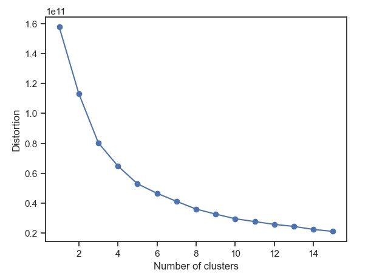

# machine_learning_project-unsupervised-learning
Alexandra Snelling 

**Project Goal:** 
Gain insights from the data sets and communicate these insights to stakeholders using appropriate visualizations and metrics to make informed decisions based on the business questions asked."

**Part I : EDA - Exploratory Data Analysis & Pre-processing**

**Data Cleaning:**
Check for Null values: 
No null values present in the dataframe.

**Continuous Numeric Features**
Check for outliers and inspect data distribution by plotting boxenplots for each column with continuous numeric data using Seaborn:
The data for all features is left skewed, indicating that the majority of orders are lower values with high value orders being more rare.
Because of this, there are a number of rare high order value outliers for each product.

Outliers:
Although these points are technically outliers, based on IQR outlier calculation, we will assume that these are actual instances of sales that are simply rare events, and continue analysis without removal of these.

Data Distribution:
The data will not be log transformed to handle the left-skew as this will distort the actual high values, which are important in this case. 
Note: log transform was tried and yeilded much worse silhouette scores in kmeans.

Scaling:
The data will also not be scaled, as this will distort the actual values which are important in this case. It was also tried and yeilded very similar silhouette scores in kmeans.

Scatterplot matrix of all continuous numeric features:

**Data Description:**
Inspect descriptive summary statistics for each column.
Channel and Region columns appear to be categorical.

Labels from Kaggle source data identify channel, region and other categories with continuous data as follows:

CHANNEL : customers Channel - Hotel (Hotel/Restaurant/Cafe) or Retail channel (Nominal)
REGION : customers Region Lisnon, Oporto or Other (Nominal)
All OTHER CATEGORIES : annual spending (m.u.) on *category (Continuous)

https://www.kaggle.com/datasets/binovi/wholesale-customers-data-set

We will replace the integers in the channel and region categories with their actual values.

CHANNEL:
1 = Hotel/Restaurant
2 = Retail
REGION:
1 = Lisnon
2 = Oporto
3 = Other

**Categorical Features:**

Bar plots of Channel and Region categories to explore distribution

One-Hot Encoding Channel and Region:

One-hot encode the Channel and Region columns.
These columns were originally encoded as Channel(1,2) and Region (1,2,3)
These categories are not ordinaland and should not be interpreted as such.
One-hot encoding will circumvent this issue.

**Correlation Matrix:**
Plot correlation matrix of all continuous numeric features

We can see a strong relationship between Detergents_Paper and Grocery with correlation of 0.92
We can see a relationship >0.5 between Milk and Grocery as well as Detergents_Paper
We can also see that Channel value (hotel vs Retail) has a relationship >0.5 with Grocery and Detergents_Paper
The Region (Lisnon, Oporto, Other) appears to have very little correlation to any other featues.

**Part II - KMeans Clustering**
Kmean for up to 15 clusters assessed

Based on the elbow curve, it appears that between 2-4 clusters will be optimal.

Silhoutte Score plotted for up to 15 clusters:

silhouette score for 2 clusters: 0.5115333898779053
silhouette score for 3 clusters: 0.4783511430782059
silhouette score for 4 clusters: 0.3866313700058197
...

The best (highest) silhouette score is obtained with only 2 clusters.

The final Kmeans model was fit: 

km = KMeans(n_clusters=2, 
            n_init= 10,
            random_state=0)

Clusters were assigned to each row in a new column.

Correlation Matrix with KMeans Cluster Labels:

Scatterplot Matrix of Highly Correlated Features with Kmeans Cluster Labels:

**Part III - Hierarchical Clustering**
Silhoutte score assessed for different cluster numbers in hierarchical clustering and linkage methods.

simple linkage:
silhouette score for 2 clusters: 0.795746776254181
silhouette score for 3 clusters: 0.7261527582362313
...
complete linkage:
silhouette score for 2 clusters: 0.7275938826458236
silhouette score for 3 clusters: 0.7129985366958633
...
average linkage:
silhouette score for 2 clusters: 0.795746776254181
silhouette score for 3 clusters: 0.7459932776249836
...
wards linkage:
silhouette score for 2 clusters: 0.34471876450084604
silhouette score for 3 clusters: 0.37501552145375117
...

Again we see the best silhouette score for 2 clusters in both simple and average linkage.

**Part IV - PCA**
Principal Component analysis performed

Component 1 : Fresh
Component 2 : Milk
Component 3 : Grocery
Component 4 : Frozen
Component 5 : Detergents_Paper
Component 6 : Delicassen

We can see that the Fresh and Milk features of the dataset are the Principal Components.

**Part V - Conclusion**
We can see a strong relationship between Detergents_Paper and Grocery with correlation of 0.92

The KMeans Model was optimized at a silhouette score of 0.51 with 2 clusters, putting the greatest weight on the 'Fresh' component, followed by 'Frozen', 'Delicassen', and 'Milk'.

The Heirarchical Cluster Model was optimized at a silhouette score of 0.79 with 2 clusters as well.
(However, considering how little of the data was in one of the clusters, this model does not appear to be a good fit for our data.)

We can see that the Fresh and Milk features of the dataset are the Principal Components.

Considering the frequent recurrence of Fresh and Milk in clustering and PCA, it may be worht investigating these products from a business standpoint to determine how they differ from their other products and in what ways they could capitalize on them.